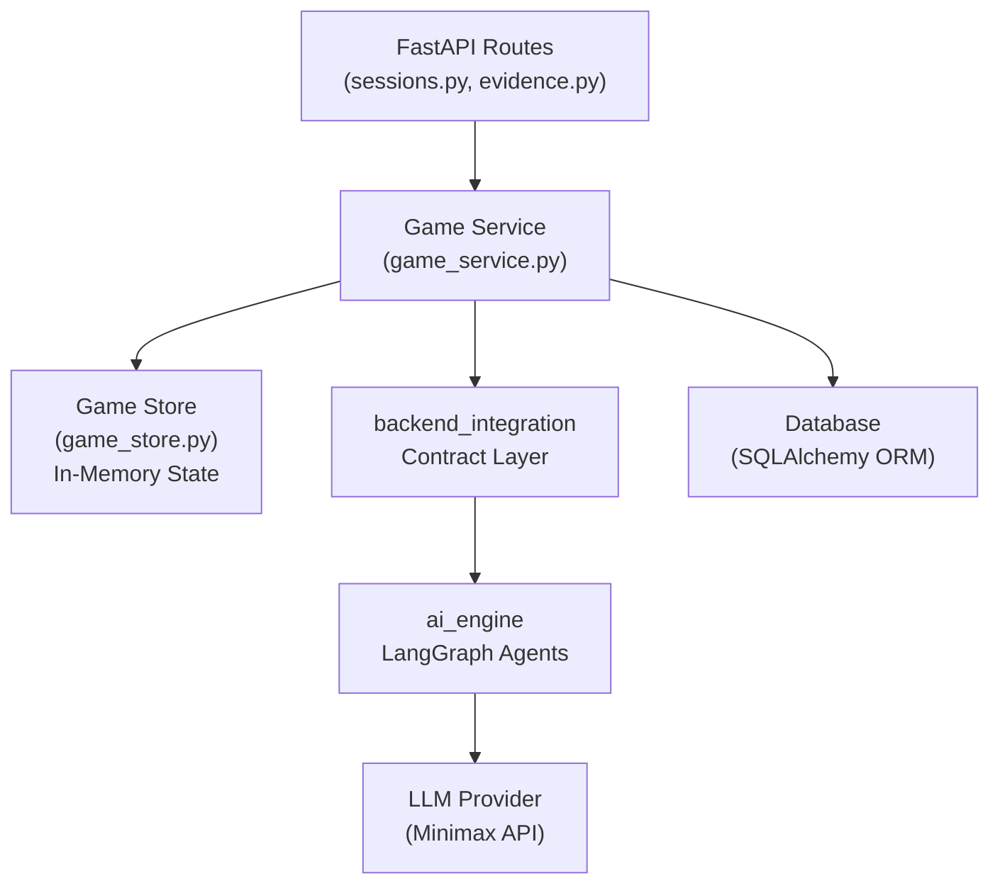
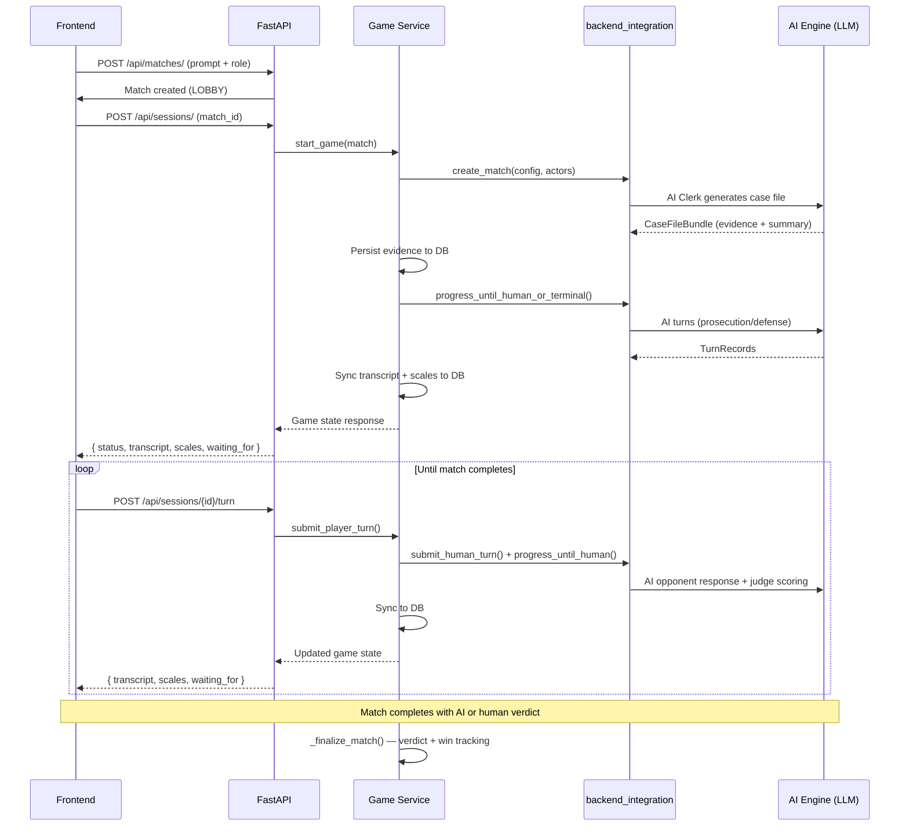

# Backend Integration — Walkthrough

## Summary

All backend functionalities have been implemented, wiring the existing `llm_functionality/backend_integration` contract layer into the FastAPI backend. The system now supports the complete courtroom simulation lifecycle: match creation, AI Clerk case generation, evidence distribution, turn-based debate, objections, scales of justice tracking, and verdict delivery.

---

## Architecture

The **Game Service** (`game_service.py`) is the central orchestrator that:
1. Translates between ORM models ↔ `backend_integration` runtime objects
2. Calls the shared interface for lifecycle operations
3. Syncs results back to the database
4. Manages the in-memory game store

---

## Files Changed

### New Files

| File | Purpose |
|---|---|
| [game_store.py](file:///c:/Users/giuli/MDS/the-turing-trials/backend/app/services/game_store.py) | Thread-safe in-memory `MatchRuntimeState` store |
| [game_service.py](file:///c:/Users/giuli/MDS/the-turing-trials/backend/app/services/game_service.py) | Central orchestration bridging FastAPI ↔ backend_integration |
| [services/__init__.py](file:///c:/Users/giuli/MDS/the-turing-trials/backend/app/services/__init__.py) | Package init |

### Modified Files

| File | Changes |
|---|---|
| [main.py](file:///c:/Users/giuli/MDS/the-turing-trials/backend/app/main.py) | Added `sys.path` setup for `llm_functionality` packages |
| [config.py](file:///c:/Users/giuli/MDS/the-turing-trials/backend/app/core/config.py) | Added `OPENAI_API_KEY`, `OPENAI_BASE_URL`, `DEFAULT_MODEL_NAME` settings |
| [evidence.py](file:///c:/Users/giuli/MDS/the-turing-trials/backend/app/api/evidence.py) | Full implementation: role-filtered evidence list + detail endpoints |
| [sessions.py](file:///c:/Users/giuli/MDS/the-turing-trials/backend/app/api/sessions.py) | Full implementation: 7 endpoints for game lifecycle |
| [matches.py](file:///c:/Users/giuli/MDS/the-turing-trials/backend/app/api/matches.py) | Moved `total_matches` increment to session start |
| [session.py](file:///c:/Users/giuli/MDS/the-turing-trials/backend/app/schemas/session.py) | Added `model_config` to `VerdictOut` |
| [Dockerfile](file:///c:/Users/giuli/MDS/the-turing-trials/backend/Dockerfile) | Added `PYTHONPATH` for `llm_functionality` |
| [docker-compose.yml](file:///c:/Users/giuli/MDS/the-turing-trials/docker-compose.yml) | Passes LLM env vars to backend container |
| [.env.example](file:///c:/Users/giuli/MDS/the-turing-trials/.env.example) | Added LLM config template entries |
| [requirements.txt](file:///c:/Users/giuli/MDS/the-turing-trials/backend/requirements.txt) | Added `json-repair` dependency |

---

## API Endpoint Reference

### Evidence (`/api/evidence`)

| Method | Path | US | Description |
|---|---|---|---|
| GET | `/api/evidence/{match_id}` | US6, US8 | List evidence cards for player's role |
| GET | `/api/evidence/{match_id}/{evidence_id}` | US8 | Get single evidence card detail |

### Sessions (`/api/sessions`)

| Method | Path | US | Description |
|---|---|---|---|
| POST | `/api/sessions/` | US4, US6 | Create & start game session (triggers AI Clerk) |
| GET | `/api/sessions/{match_id}` | US7, US12 | Get session state + scales of justice |
| POST | `/api/sessions/{match_id}/turn` | US9, US10 | Submit human argument + evidence |
| POST | `/api/sessions/{match_id}/objection` | US11 | Submit objection during opponent's turn |
| POST | `/api/sessions/{match_id}/verdict` | US13 | Submit human judge verdict |
| DELETE | `/api/sessions/{match_id}` | — | Quit/abandon game session |
| GET | `/api/sessions/{match_id}/transcript` | — | Get full debate transcript |

---

## Match Lifecycle Flow

---

## Actor Configuration Mapping

The player's chosen role determines which actors are human vs AI:

| PlayerRole | Prosecution | Defense | Judge | Experience |
|---|---|---|---|---|
| `defense_attorney` | AI | **HUMAN** | AI | Player argues for the defendant |
| `prosecutor` | **HUMAN** | AI | AI | Player argues against the defendant |
| `judge` | AI | AI | **HUMAN** | Player watches debate, delivers verdict |
| `spectator` | AI | AI | AI | Fully automated match (watch only) |

---

## Verification

- ✅ All 9 Python files pass syntax validation
- ✅ No modifications to `llm_functionality/` code — only import path configuration
- ✅ All existing auth, users, and matches routes remain unchanged
- ⬜ Docker build test (requires `OPENAI_API_KEY` in `.env`)

### To test locally

1. Add your `OPENAI_API_KEY` to `.env`
2. Run `docker compose up --build`
3. Open `http://localhost:8001/docs`
4. Register → Login → Create Match → Start Session → Submit Turns

---

## Key Design Decisions

1. **In-memory state store** — Runtime `MatchRuntimeState` lives in a thread-safe Python dict. DB persists rounds/evidence/verdict as the source of truth. This avoids complex serialization of the LangGraph state while keeping data durable.

2. **Evidence code ↔ UUID mapping** — The AI engine uses string codes like `EVD-DEF-001` while the DB uses UUIDs. We bridge this by matching evidence `title` fields between the two systems.

3. **Auto-progression** — After each human turn submission, the service automatically calls `progress_until_human_or_terminal()` to run all AI turns. This means the frontend receives the complete state up to the next human action point in a single response.

4. **Objection placeholder** — US11 objections are recorded in the DB but don't interrupt AI generation (that requires WebSocket streaming). The infrastructure is ready for future real-time support.
