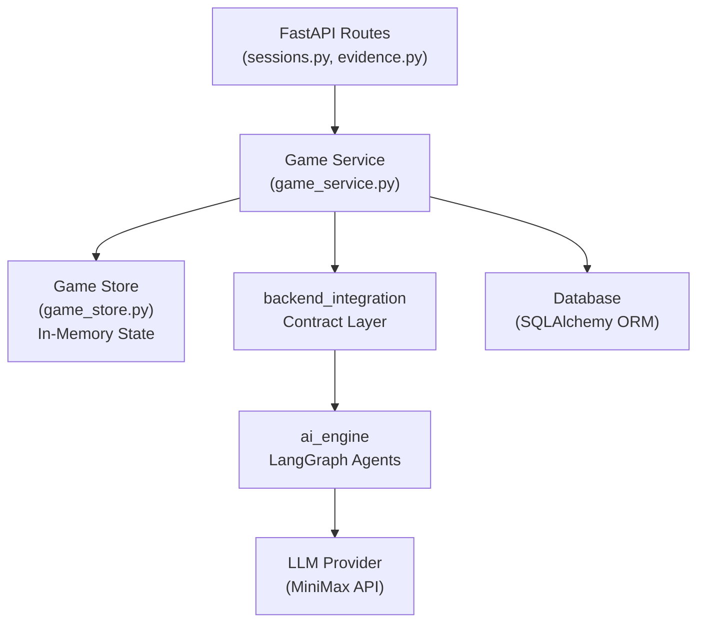

# AI Usage Report — The Turing Trials

> This document describes how AI tools were used during the development of **The Turing Trials**, an interactive multi-agent courtroom simulation. Each team member documents the AI tools they used, the tasks they delegated, and how AI contributed to their area of responsibility.

---

## Table of Contents

- [Project Overview](#project-overview)
- [Georgiana-Raluca Negru](#georgiana-raluca-negru)
- [Giulia Poalelungi](#giulia-poalelungi)
- [Minea Stefan Teodor](#minea-stefan-teodor)
- [Amalia-Elena Riclea](#amalia-elena-riclea)

---

## Project Overview

**The Turing Trials** is a full-stack web application that simulates a courtroom environment using a multi-agent LLM architecture. Rather than being a simple chatbot, the application coordinates a structured legal debate between AI and/or human-controlled courtroom roles.

The final application stack consists of:

- **Frontend**: Next.js 14, React, TypeScript, App Router, Tailwind CSS
- **Backend**: FastAPI + SQLAlchemy (async) + PostgreSQL 16
- **AI Layer**: LangChain/LangGraph orchestration with AI agents for the Clerk, Prosecutor, Defense, and Judge
- **Integration Layer**: `llm_functionality/backend_integration`, which provides a stable contract between the FastAPI backend and the AI engine
- **Infrastructure**: Docker + Docker Compose, Nginx reverse proxy, Ubuntu VPS, GitHub Actions CI/CD

The project evolved from an initial AI-engine prototype into a complete product with authentication, match persistence, role-based gameplay, evidence usage constraints, an objection mechanic, spectator/judge modes, match history, leaderboard support, and deployment automation.

---

## Georgiana-Raluca Negru

### AI Tool Used

| Tool | Model | Access Method |
|------|-------|---------------|
| Claude Code (Anthropic) | Claude Sonnet 4.6 | CLI (`claude` command in terminal) |

Claude Code is an agentic AI coding assistant that operates directly in the terminal with access to the file system, shell, and Git. It was used interactively throughout development — not only for code generation, but also for architecture decisions, debugging, infrastructure setup, and deployment troubleshooting.

---

### Areas of Contribution

#### 1. Project Architecture

Claude assisted in designing and implementing the overall full-stack architecture from scratch:

- **Backend structure**: defined the FastAPI project layout with separation between `app/` (HTTP layer: routers, models, schemas, services) and `llm_functionality/` (AI engine: LangGraph agents, state machines, adapters). This separation keeps the LLM orchestration logic decoupled from the REST API.
- **Docker Compose setup**: defined the three-service compose file (`db`, `backend`, `frontend`) with correct dependency ordering, health checks, and environment variable injection.

#### 2. Objection Feature

Claude implemented the end-to-end **Objection mechanic**, one of the key gameplay features:

- **DB migration**: added `prosecution_objection_used` and `defense_objection_used` boolean columns to `game_sessions`.
- **AI prompt injection**: modified the Prosecutor and Defense prompts to react to a pending objection in the state, forcing the affected AI role to address the disputed argument directly in its next turn.
- **Frontend integration**: added the Objection button in the courtroom UI (`courtroom/[matchID]/page.tsx`), with disabled state after use and visual feedback.
- **Implementation cleanup**: resolved an unused `ObjectionResponse` import caught by `ruff` in CI.

#### 3. DevOps — Nginx & Server Deployment

Claude guided the deployment of the application to an Ubuntu Server:

- **Nginx configuration**: set up Nginx as a reverse proxy routing `/api/` and `/ws/` traffic to the FastAPI backend container and all other traffic to the Next.js frontend container. Configured `proxy_pass`, `proxy_http_version 1.1`, and WebSocket upgrade headers for real-time trial updates.
- **Environment configuration**: identified that `NEXT_PUBLIC_API_URL` is baked into the Next.js bundle at build time, so `docker compose up --build` is required after changing the domain. Diagnosed that `docker compose restart` does not re-read `.env`, because environment variables are injected at container creation.
- **Database migrations**: prepared safe `ALTER TABLE` commands for adding new columns to live production databases, including the objection columns.
- **Deployment checklist**: produced a repeatable deployment procedure: pull latest code → update `.env` → run DB migration → `docker compose up --build -d` → verify containers → check Nginx.
- **API key debugging**: diagnosed a production issue where the MiniMax LLM API key was not picked up because the container had only been restarted, not recreated. The fix was to run `docker compose up -d` after updating `.env`.

#### 4. CI/CD Pipeline

Claude implemented the GitHub Actions CI/CD pipeline:

- **Backend CI** (`backend-ci.yml`): runs `ruff` for linting/format checking and `mypy` for type checking on pushes and pull requests targeting `main`.
- **Frontend CI** (`frontend-ci.yml`): runs `eslint` and `tsc --noEmit` for TypeScript validation.
- **Pipeline fixes**: resolved multiple CI failures, including unused Python imports caught by `ruff`, ESLint errors in TSX files, missing dependencies in `useEffect` hooks, and TypeScript strict-mode violations.

#### 5. Runtime Bug Fixes

Claude diagnosed and fixed several runtime bugs encountered during testing:

- **Evidence cross-role title collision** (`game_service.py`): `_get_evidence_code` mapped a DB UUID to a runtime evidence code by searching all evidence lists (prosecution + defense + shared) in order. If the AI generated a prosecution and a defense card with the same title, the prosecution card's code could be returned for the defense player's evidence, failing the `allowed_ids` validation check. This was fixed by scoping the title search to the evidence list matching the card's DB `assigned_role`.
- **Evidence display in messages**: fixed evidence cards not rendering correctly inside argument message bubbles in the courtroom view.

---

### How Claude Code Was Used in Practice

Claude Code was used in an **interactive, conversational** style rather than as a one-shot code generator. The typical workflow was:

1. **Describe the feature or problem** in natural language, such as "implement the objection feature" or "the evidence attachment gives a 500 error".
2. **Claude reads the relevant files** autonomously, traces the code path, and identifies the root cause or the correct implementation point.
3. **Claude proposes an approach** and either waits for confirmation or proceeds with edits.
4. **Claude runs shell commands** such as linting, tests, or `git log` to verify correctness.
5. **Claude commits the changes** with descriptive commit messages when asked.

---

## Giulia Poalelungi

### Backend Responsibilities

I was responsible for the **backend** of the application: wiring the FastAPI API layer to the pre-existing `llm_functionality/backend_integration` contract, implementing the full game session lifecycle, configuring Docker/environment, and fixing authentication bugs. All backend work was done using AI agentic assistants.

---

### AI Tool Used

| Tool | Model | Access Method |
|------|-------|---------------|
| Antigravity IDE (Google DeepMind) | Claude Opus 4.6 (Thinking) | IDE-integrated agent with terminal, file system, and Git access |

Antigravity IDE is an agentic coding assistant embedded in the editor. It has direct access to the project file system, can run shell commands, interact with Git, install tools such as GitHub CLI, and manage GitHub issues autonomously within a single conversation.

---

### Areas of Contribution

#### 1. Full Backend Integration (1,361 lines in a single session)

The most significant use of AI was delegating the **entire backend integration** to the agent in a single prompt: *"Read the .md and folder to get context of this project. Then implement all backend functionalities needed, based on description and llm-functionality already implemented."*

The agent autonomously:

- **Read and understood** the `backend_integration/README.md` contract documentation and the existing codebase structure.
- **Produced an implementation plan** covering configuration wiring, in-memory state storage, game orchestration, evidence routing, sessions routing, match creation, Scales of Justice synchronization, and win tracking.
- **Generated 1,361 lines of code across 13 files**:

| File | Lines | Purpose |
|------|-------|---------|
| `game_service.py` | 727 | Central orchestrator bridging FastAPI ↔ backend_integration |
| `sessions.py` | 403 | API endpoints for the full game lifecycle |
| `evidence.py` | 121 | Role-filtered evidence list + detail endpoints |
| `game_store.py` | 43 | Thread-safe in-memory `MatchRuntimeState` store |
| + 9 other files | — | Config, Dockerfile, docker-compose, schemas, requirements |

- **Verified syntax** of generated files by running Python AST parsing checks.
- **Generated architecture diagrams** documenting the backend layer stack and the match lifecycle sequence.

The architecture diagram generated by the AI:

The actor-to-role mapping designed by the AI:

| PlayerRole | Prosecution | Defense | Judge | Experience |
|---|---|---|---|---|
| `defense_attorney` | AI | **HUMAN** | AI | Player argues for the defendant |
| `prosecutor` | **HUMAN** | AI | AI | Player argues against the defendant |
| `judge` | AI | AI | **HUMAN** | Player watches debate, then delivers verdict |
| `spectator` | AI | AI | AI | Fully automated match |

#### 2. JWT Token Expiry Bug — Diagnosis, Fix, and GitHub Issue Management

A bug was reported: users were forced to re-authenticate after around 30 minutes of playing a match. I gave the agent one instruction: *"Verify auth tokens, it was reported that after 30mins the token expires. Create an issue for this on Git, solve it and close it. Close also other issues assigned to me."*

The agent performed the entire workflow autonomously:

1. **Diagnosis** — scanned `config.py`, `security.py`, `api.ts`, and the courtroom page. It identified two root causes: `ACCESS_TOKEN_EXPIRE_MINUTES` was set to 30 minutes, and the frontend `apiFetch()` helper did not automatically refresh expired access tokens.
2. **Implementation** — rewrote `frontend/lib/api.ts` to add a transparent 401 interceptor: on token expiry, it calls `POST /api/auth/refresh` using the httpOnly refresh cookie, stores the new access token, and retries the failed request once. It also added deduplication for concurrent refresh attempts and increased `ACCESS_TOKEN_EXPIRE_MINUTES` from 30 to 120 as a safety net.
3. **GitHub workflow** — the agent installed GitHub CLI, authenticated via browser device flow, created issue [#25](https://github.com/georgiana-raluca-negru/the-turing-trials/issues/25), committed the fix with a message closing the issue, pushed to `giulia_branch`, and closed the issue with a reference to the commit. It also found and closed issue [#13](https://github.com/georgiana-raluca-negru/the-turing-trials/issues/13), which had already been completed.

All of this happened in a single conversation, without manual intervention beyond approving browser authentication for GitHub CLI.

#### 3. Environment & Docker Configuration

During the backend integration session, the agent also handled infrastructure changes:

- **Dockerfile** — added `ENV PYTHONPATH="/app/llm_functionality:${PYTHONPATH}"` so `ai_engine` and `backend_integration` packages are importable from the FastAPI app without modifying the `llm_functionality/` code.
- **docker-compose.yml** — added pass-through of `OPENAI_API_KEY`, `OPENAI_BASE_URL`, and `DEFAULT_MODEL_NAME` environment variables to the backend container.
- **`.env.example`** — added template entries for LLM configuration variables.
- **`requirements.txt`** — added `json-repair`, used by the AI engine parser utilities.

---

### How Antigravity IDE Was Used in Practice

The workflow was **delegation-oriented** rather than conversational. I gave high-level instructions and the agent executed end-to-end:

1. **Delegate a task** in natural language, such as "implement all backend functionalities" or "fix the token expiry and create a GitHub issue".
2. **The agent reads documentation and code** autonomously, including contract docs, routers, models, schemas, and AI engine code.
3. **The agent produces a plan and asks for approval** before making changes.
4. **The agent implements, verifies, and commits**, including syntax checks, diagrams, and descriptive commit messages.
5. **The agent manages external tools** when needed, including GitHub CLI installation, authentication, issue creation, and issue closure.

The key difference from my colleagues' usage is that I used AI for **bulk generation of entire subsystems** rather than iterative feature-by-feature development. This was efficient, but it required careful post-review. A subtle evidence lookup bug was discovered later during playtesting, which shows that generated backend subsystems still need integration-level validation.

---

## Minea Stefan Teodor

### LLM Engineering Responsibilities

I was responsible for the **LLM engineering** part of the application, especially the design and stabilization of the AI engine inside `llm_functionality`. My work focused on the LangGraph state model, structured agent outputs, backend-facing AI integration, and evaluation strategy for the multi-agent courtroom system.

The most important part of my role was ensuring that the AI agents did not behave like independent chatbots, but like participants in a controlled, stateful simulation. That meant defining how the case context, evidence inventory, argument history, speaker role, turn number, and verdict-related data should move through the graph and remain consistent across the trial.

---

### AI Tool Used

| Tool | Model | Access Method |
|------|-------|---------------|
| OpenAI Codex | Codex model 5.4, xhigh reasoning setting | Agentic coding workflow with multi-agent planning |

I used Codex as an agentic engineering assistant for architecture planning, implementation review, structured output design, parser hardening, backend-integration planning, test generation, and agent evaluation design. The `xhigh` reasoning setting was especially useful for longer planning sessions where multiple components had to remain consistent: LangGraph state, Pydantic schemas, prompt contracts, backend adapters, and tests.

---

### Areas of Contribution

#### 1. LangGraph GraphState Configuration

A major part of my AI-assisted work was configuring the LangGraph state used by the courtroom agents.

With Codex, I iterated on the shape and semantics of the shared match state, including:

- **Case-level state**: `user_prompt`, generated case summary, charges, and background story.
- **Evidence state**: prosecution evidence, defense evidence, evidence IDs, usage flags, and role-specific availability.
- **Conversation state**: message history, speaker identity, attached evidence IDs, and turn order.
- **Runtime state**: round/cycle number, debate progression, warnings, and system events.
- **Integration state**: which fields should remain internal to the AI engine and which should be mapped into backend-facing runtime objects.

The main challenge was keeping the state simple enough for LangGraph nodes to pass around, while still expressive enough for backend persistence and gameplay rules. Codex helped compare alternative state shapes and identify where to separate transient LLM context from canonical match state.

#### 2. Structured Output Modeling and Parsing

I used Codex to design and refine the structured output layer for the agents. This included the Pydantic models used to represent evidence, case context, arguments, verdicts, and turn outputs.

The work focused on:

- **Pydantic schemas** for `Evidence`, `CaseContext`, `Argument`, `CaseFile`, `Verdict`, and `TurnOutput`.
- **Strict output validation** so that AI-generated case files and arguments could be consumed by the backend safely.
- **Parsing resilience** for common LLM output problems, including Markdown-wrapped JSON, malformed JSON, schema metadata accidentally included in responses, reasoning blocks, nested payload wrappers, and empty or invalid repaired data.
- **Evidence ID validation** so agents could attach only valid evidence cards instead of inventing unsupported references.
- **Clear output contracts** for the AI Clerk, Prosecutor, Defense, and Judge nodes.

This work was central to reducing hallucinations. The agents were not simply asked to "argue well"; they were constrained to return data that matched the project models and could be checked before being accepted into the game state.

#### 3. Multi-Agent Planning for Backend Integration

I used Codex with a multi-agent planning approach for the backend integration work inside `llm_functionality`. Instead of treating the AI engine and backend as a single block, I used AI to reason about the system from several perspectives:

- **AI-engine perspective**: what the LangGraph workflow needs to generate a case, advance turns, and produce a verdict.
- **Backend-contract perspective**: what FastAPI needs from the AI layer without directly depending on internal LangGraph node implementations.
- **State-machine perspective**: how match progression should handle AI turns, human turns, human judge verdicts, quitting, and terminal states.
- **Testing/evaluation perspective**: what behavior must be deterministic enough to test, even when the generated text itself is probabilistic.

This planning contributed to the separation between the internal `ai_engine` and the `backend_integration` contract layer. The goal was to let backend routes call stable integration functions while the actual AI orchestration remained behind adapters and ports.

#### 4. Agent Communication and Case Context Design

Another significant responsibility was designing how information flows between agents.

The agents needed to share enough context to create a coherent trial, but not so much that each role could ignore its constraints. Codex helped reason through the communication model for:

- **AI Clerk → courtroom state**: generating a complete case file with crime, charges, background story, prosecution evidence, and defense evidence.
- **Prosecutor/Defense → transcript**: producing arguments grounded in available evidence and the opponent's previous statements.
- **Transcript → Judge**: giving the judge enough structured debate history to evaluate both sides and produce a reasoned verdict.
- **Evidence inventory → agents**: ensuring each side sees and uses the correct evidence set, while respecting evidence reuse rules.
- **System events → backend/frontend**: preserving warnings and runtime notes without mixing them into normal courtroom speech.

This was not only prompt-writing work. It required architectural decisions about what belongs in state, what belongs in prompts, what belongs in Pydantic models, and what should be validated after generation.

#### 5. Tests and Agent Evaluations

I used Codex to help create tests and evaluation criteria for the AI system. The main objective was to evaluate the agents as components of a controlled application, not just as free-form text generators.

The evaluation work focused on metrics such as:

| Evaluation Area | What It Checks |
|---|---|
| **Schema validity** | Whether agent outputs can be parsed into the required Pydantic models |
| **Evidence grounding** | Whether arguments use only valid evidence IDs assigned to the correct side |
| **Role adherence** | Whether each agent stays within its courtroom role and objective |
| **State consistency** | Whether round numbers, speakers, evidence usage, and transcript entries remain coherent |
| **Rebuttal quality** | Whether Prosecutor and Defense respond to the opponent's previous argument instead of ignoring it |
| **Judge consistency** | Whether verdict reasoning references the transcript and evidence rather than unrelated facts |
| **Integration correctness** | Whether backend-facing progression functions return the expected action: AI turn completed, awaiting human input, awaiting verdict, match completed, or match quit |

Codex was also used to generate and refine test scenarios for parser behavior, malformed JSON recovery, evidence attachment validation, full AI-controlled matches, mixed human/AI matches, and human-judge flows.

#### 6. Architecture Review and Iteration

Because the AI layer was connected to multiple parts of the application, I used Codex to review architectural trade-offs before committing to implementation decisions.

The most important architectural choices were:

- keeping `ai_engine` focused on the LangGraph agent workflow;
- keeping `backend_integration` as the stable contract layer for backend calls;
- using adapters instead of allowing FastAPI routes to call LangGraph nodes directly;
- treating the match state as canonical and validating all generated outputs before inserting them into state;
- separating persistent match data from transient LLM generation details;
- designing evaluation metrics early, so the AI system could be tested as it evolved.

This helped the project evolve from a prototype AI workflow into an application-ready LLM subsystem that could be integrated into a real backend and frontend.

---

### How Codex Was Used in Practice

My workflow with Codex was architecture-first and evaluation-driven:

1. **Define the component or risk** in natural language, such as GraphState design, evidence validation, output parsing, or backend integration.
2. **Use multi-agent planning** to split the problem into AI-engine, backend-contract, state-machine, and testing perspectives.
3. **Ask Codex to propose alternatives** and compare trade-offs before implementation.
4. **Implement or refine the code**, especially around LangGraph state, Pydantic schemas, parser utilities, and integration contracts.
5. **Generate tests and evaluation cases** to check that the agents followed the rules of the simulation.
6. **Review outputs manually**, because AI-generated code and prompts can look correct while still failing under realistic gameplay edge cases.

The main value of AI in my work was not simply writing code faster. It helped me reason across the full LLM subsystem: graph state, agent roles, structured outputs, backend communication, and measurable evaluation criteria.

---

## Amalia-Elena Riclea

### Frontend Responsibilities

I was responsible for the frontend of the application: Next.js 14, TypeScript, App Router, Tailwind CSS, the courtroom interface, and the user-facing gameplay experience. Claude Code was used as a pair-programming assistant throughout.

---

### AI Tool Used

| Tool | Model | Access Method |
|------|-------|---------------|
| Claude Code (Anthropic) | Claude Sonnet 4.6 | VS Code extension, agentic mode |

Claude Code was used interactively inside the editor, with access to the file system, shell, and Docker across the frontend work described below.

---

### Areas of Contribution

#### 0. Scope of the Frontend Task

The frontend task covered building and maintaining:

- **Pages**: homepage/landing page, `login`, `register`, `dashboard`, `setup`, `courtroom/[matchID]`, `not-found`, and global `error` pages.
- **Courtroom screen**: chat-style transcript with role-colored message bubbles; argument input with submit/Ctrl+Enter shortcut; Case Parameters panel; evidence inventory; objection button; Judge verdict UI; and end-of-trial verdict overlay.
- **`ScalesOfJustice` component**: live horizontal balance bar driven by the backend `scales_value`.
- **`CaseSummary` and evidence components**: display of generated case background, charges, and role-specific evidence cards.
- **`Toast` / `ToastProvider`**: global toast notifications for success, error, and info feedback.
- **`Spinner`** and loading states for async operations.
- **Theming system** (`globals.css`): CSS custom properties for dark/light theme variables, role-based chat bubble colors, text colors, borders, and headings.
- **API integration layer** (`lib/api.ts`): `apiJson` / `apiFetch` helpers wrapping `fetch`, attaching auth tokens, and handling errors consistently.
- **Game-state logic**: mapping backend transcript entries into frontend chat messages, tracking used evidence cards, computing the displayed Scales of Justice score, and implementing a spectator loop for Judge/Spectator roles.

#### 1. Console Error Fixes

Two recurring console errors on the homepage were diagnosed and fixed with Claude:

- **Hydration mismatch** (`app/page.tsx`): the `isLoggedIn` state was initialized using `localStorage` during render, producing different server/client output. This was fixed by initializing with `useState(false)` and syncing from `localStorage` inside `useEffect`.
- **Script tag warning** (`app/layout.tsx`): a `<Script strategy="beforeInteractive">` was wrapped in a manual `<head>` element, which is unsupported in the App Router. This was fixed by moving it into `<body>`, where Next.js hoists `beforeInteractive` scripts correctly.

Both fixes were verified with `eslint` and a full `npm run build`.

#### 2. Error Pages Theming

The `not-found.tsx` and `error.tsx` pages had hardcoded `slate-*` Tailwind colors from an earlier iteration. With Claude's help, these were restyled to match the dark cyber-courtroom theme by replacing hardcoded colors with project CSS variables such as `--text-fg`, `--text-muted`, `--border-sub`, and `--heading`, while intentionally keeping the red/orange glitch accent colors for the 404/500 numerals.

#### 3. Database Bug Fix — "Failed to Fetch" on Generate Simulation

The "Generate Simulation" button returned a generic `Failed to fetch` error. Claude debugged it by cross-referencing frontend code, live backend container logs, and SQLAlchemy models:

- Root cause: the `game_sessions` table in Postgres was missing the `prosecution_objection_used` and `defense_objection_used` boolean columns that were already defined in the Python model.
- The project uses `Base.metadata.create_all()`, which creates new tables but does not alter existing ones, so newly added model columns were not applied to the live database.
- Fix: ran `ALTER TABLE game_sessions ADD COLUMN IF NOT EXISTS ... DEFAULT false` for both columns directly against the running Postgres container, preserving existing match data.

#### 4. Homepage Redesign

The landing page (`app/page.tsx`, `app/globals.css`) was redesigned with Claude toward a high-stakes, dark cyber-courtroom aesthetic:

- Updated body text color and line-height for readability.
- Replaced hero copy and added a terminal-style typing animation component (`TypingSubtitle`) with a blinking cursor.
- Added a slow pulsing neon-green glow to primary CTA buttons.
- Added hover effects to the "How It Works" and "Rules of the Court" cards.
- Added a subtle animated cyber-grid background and staggered fade-in-up entrance animations.

#### 5. Courtroom UI Redesign

The courtroom game layout (`app/courtroom/[matchID]/page.tsx`) was restructured with Claude:

- Converted the left Case Parameters panel into a collapsible slide-out sidebar to maximize chat space.
- Replaced the static evidence list with a new **`EvidenceVault`** component: a compact stack-of-case-files graphic that opens a fullscreen dark overlay. Evidence cards are shown in a scrollable, snap-aligned carousel with floating/fan-in animations, solving an earlier issue where cards overlapped and were too small to read.

---

### How Claude Code Was Used in Practice

The workflow was conversational and iterative:

1. **Describe the problem or desired change** in natural language, such as "fix this hydration error", "redesign the homepage", or "why does this button do nothing".
2. **Claude inspects the relevant files**, including frontend components, CSS, Docker config, backend models, and logs when needed.
3. **Claude implements the change**, then verifies it with `eslint`, `npm run build`, or Docker/SQL commands depending on the change.
4. **Claude explains trade-offs and asks before risky actions**, such as modifying `.env`, restarting containers, or running `ALTER TABLE` on the database.

---

*Report compiled: June 2026*
