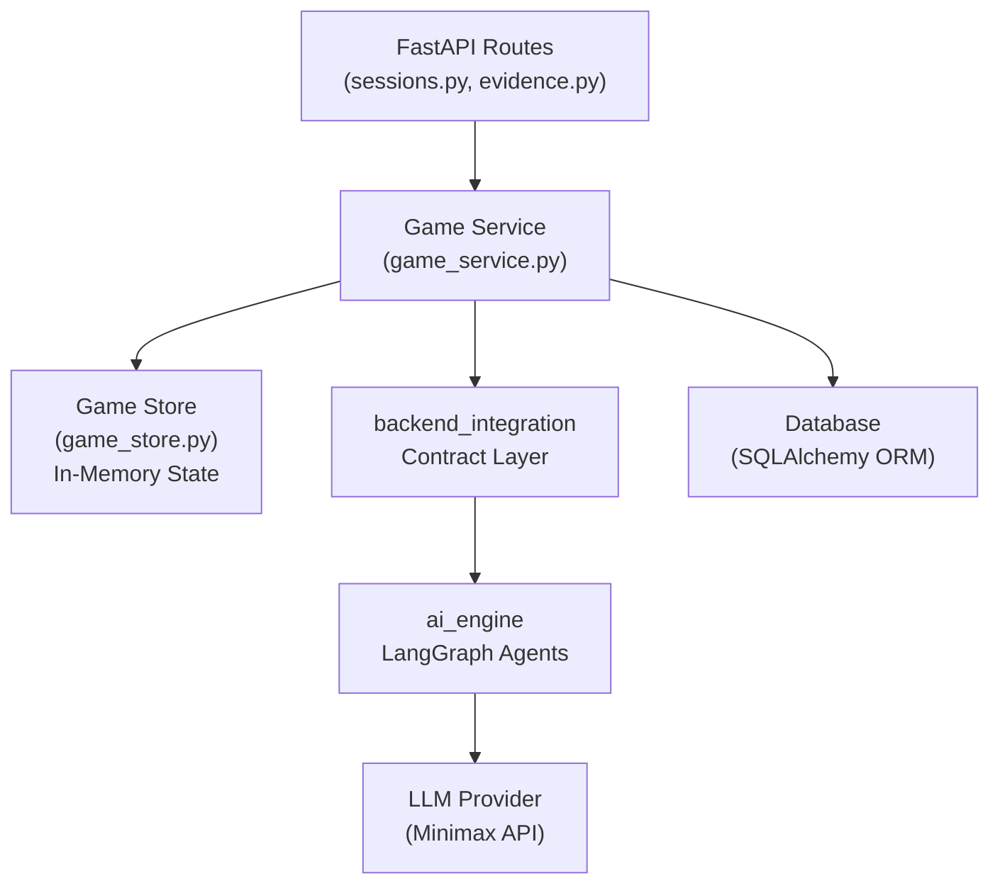

```mermaid
graph TD
    A["FastAPI Routes<br/>(sessions.py, evidence.py)"] --> B["Game Service<br/>(game_service.py)"]
    B --> C["Game Store<br/>(game_store.py)<br/>In-Memory State"]
    B --> D["backend_integration<br/>Contract Layer"]
    B --> E["Database<br/>(SQLAlchemy ORM)"]
    D --> F["ai_engine<br/>LangGraph Agents"]
    F --> G["LLM Provider<br/>(Minimax API)"]
```
