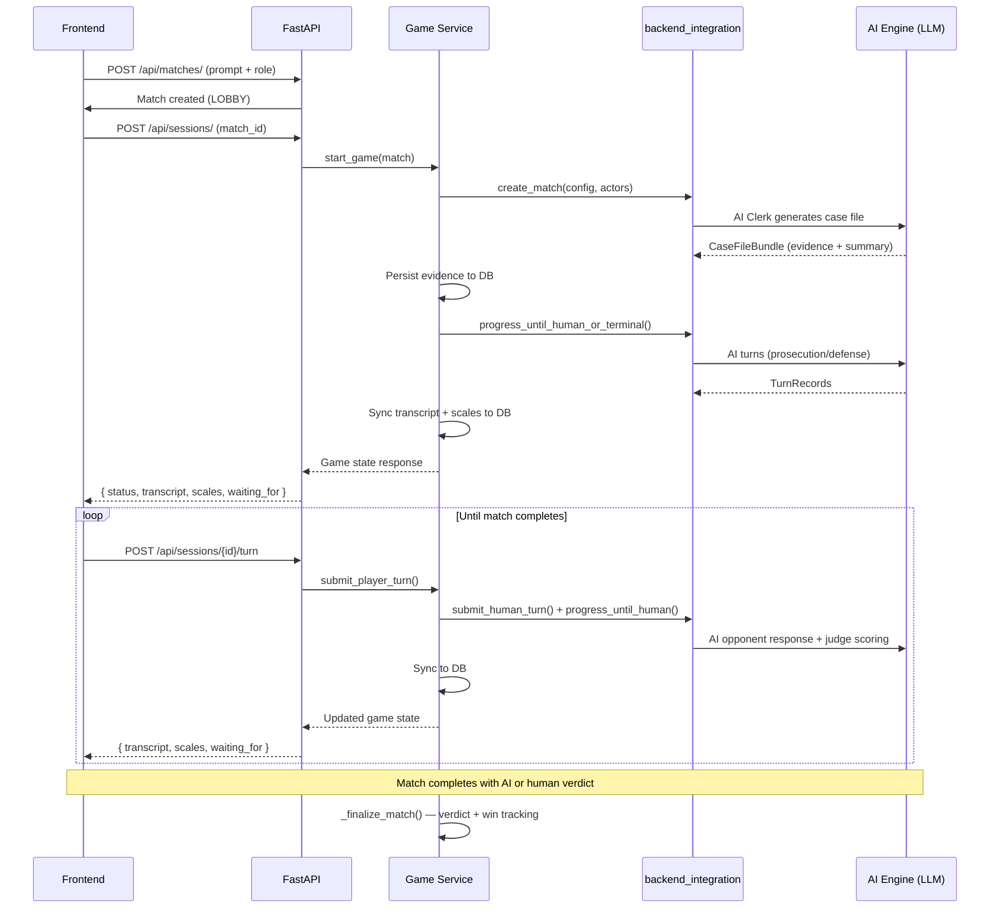

```mermaid
sequenceDiagram
    participant FE as Frontend
    participant API as FastAPI
    participant GS as Game Service
    participant BI as backend_integration
    participant AI as AI Engine (LLM)

    FE->>API: POST /api/matches/ (prompt + role)
    API->>FE: Match created (LOBBY)

    FE->>API: POST /api/sessions/ (match_id)
    API->>GS: start_game(match)
    GS->>BI: create_match(config, actors)
    BI->>AI: AI Clerk generates case file
    AI-->>BI: CaseFileBundle (evidence + summary)
    GS->>GS: Persist evidence to DB
    GS->>BI: progress_until_human_or_terminal()
    BI->>AI: AI turns (prosecution/defense)
    AI-->>BI: TurnRecords
    GS->>GS: Sync transcript + scales to DB
    GS-->>API: Game state response
    API-->>FE: { status, transcript, scales, waiting_for }

    loop Until match completes
        FE->>API: POST /api/sessions/{id}/turn
        API->>GS: submit_player_turn()
        GS->>BI: submit_human_turn() + progress_until_human()
        BI->>AI: AI opponent response + judge scoring
        GS->>GS: Sync to DB
        GS-->>API: Updated game state
        API-->>FE: { transcript, scales, waiting_for }
    end

    Note over FE,AI: Match completes with AI or human verdict
    GS->>GS: _finalize_match() — verdict + win tracking
```
